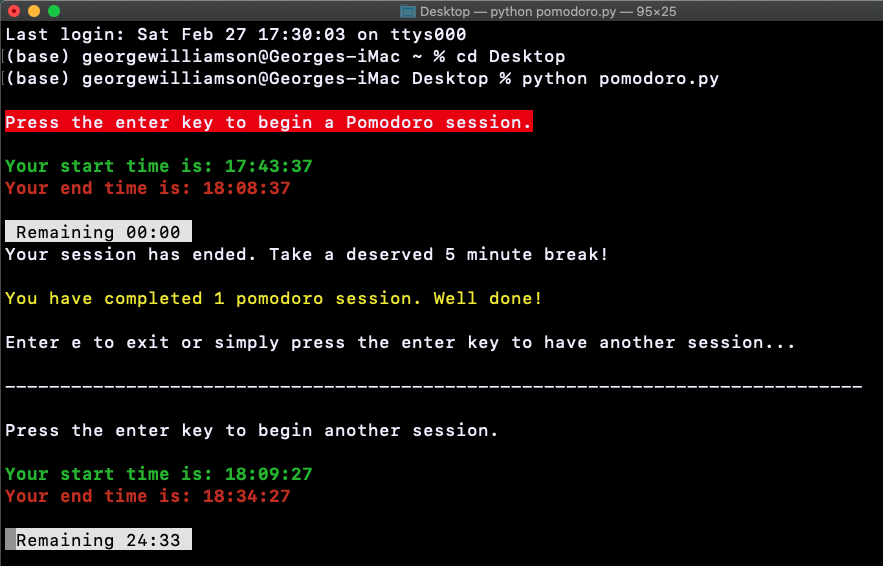

# A command line interface Pomodoro Technique timer

A python script that displays a [Pomodoro Technique](https://en.wikipedia.org/wiki/Pomodoro_Technique) timer in the command line interface (terminal).
This timer is handy if you are trying to apply the pomodoro technique in your study sessions, as it displays the time remaining for each session and also keeps track of the total number of sessions completed.
I have been using it personally to keep track of time in my own study sessions.

Note: I've never tested this on windows, only on macOS.
